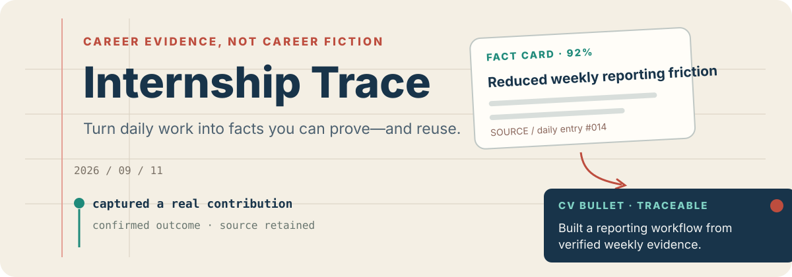

<p align="center">
  
</p>

<p align="center"><strong>English</strong> · <a href="./README.zh-CN.md">中文</a></p>

Three months into an internship you cannot remember what you actually did, and a
CV needs specifics.

```bash
git clone https://github.com/shenjiayi692-maker/internship-trace && cd internship-trace && npm i && npm test
```

That runs the test suite over the platform-independent core — evidence scoring,
redaction, 90-day retention, JD matching — with no WeChat toolchain. Seeing the
interface does need WeChat DevTools; see below.

Internship Trace is a high-fidelity WeChat Mini Program prototype for turning scattered daily work into career evidence you can inspect and reuse. It captures a small fact, asks at most two follow-up questions, and keeps every generated weekly report, JD match, CV bullet, and interview prompt connected to its source evidence.

## The evidence chain

```text
daily note → follow-up → fact card → confirmation → weekly report / JD match / CV / interview
```

The prototype is designed around one rule: generated wording may change, but it must not add an unconfirmed number or outcome.

- Capture with text or a simulated voice-transcription flow
- Score evidence completeness and prompt for missing context
- Redact sensitive text before it enters the reusable fact layer
- Match job requirements to existing evidence—and show gaps honestly
- Generate weekly reports, CV bullets, and targeted interview questions
- Open any generated item back to the fact cards that support it
- Export locally as copied text or a canvas-rendered report image

## Try the prototype

1. Install dependencies with `npm install`.
2. Open WeChat DevTools and import the repository root.
3. Compile with the configured `touristappid`.
4. Start from the privacy screen, then follow Today → Assets → Generate.

Suggested walkthrough:

1. Add a text or voice-style daily record.
2. Answer or skip up to two follow-up questions.
3. Confirm the resulting fact card and add an outcome if needed.
4. Generate a weekly report or paste a JD for simulated analysis.
5. Inspect the sources behind a CV bullet and its follow-up interview questions.
6. Export data, restore the sample dataset, or delete everything from My.

## Prototype boundary

This repository makes the reviewable interaction real while keeping external systems simulated:

- All product data stays in WeChat local storage.
- There are no accounts, network requests, cloud functions, model SDKs, or payments.
- AI follow-up, organization, generation, OCR, and voice transcription are deterministic simulations.
- The voice path requests microphone permission but does not record or retain audio.
- JD screenshots use a temporary WeChat path and are released after simulated recognition.

It is not a production Mini Program.

## Portable core

| Package | Responsibility |
| --- | --- |
| `apps/wechat-miniprogram/` | Native WXML, WXSS, TypeScript pages, components, and WeChat adapters |
| `packages/core/` | Platform-independent scoring, redaction, retention, generation, and matching rules |
| `packages/contracts/` | Domain types, replaceable ports, and coherent sample data |
| `scripts/` | Project structure and boundary checks |

The core and contracts packages cannot depend on `wx`, browser APIs, or a model SDK. A future PWA can replace the page layer without rewriting the evidence rules.

## Verify

Node.js 22 or newer is recommended.

```bash
npm install
npm test
npm run typecheck
npm run check
```

The test suite covers evidence scoring, the two-question cap, redaction, 90-day retention, JD matching, risk flags, and source traceability.

## Data rules

- Raw entries expire after 90 days and enter a reminder window on day 83.
- Expiry clears the raw source but retains the fact card with a source-cleared marker.
- Unconfirmed numbers become visible risk flags, not verified results.
- Every generated artifact carries fact-card IDs that can be inspected in the asset library.

## Before a real MVP

A production version needs a server-side model proxy, provider retention settings, anonymous-session design, request redaction, cost limits, real speech-to-text and OCR, subscription messages, privacy documentation, and platform review. Model keys must never be embedded in the Mini Program.
